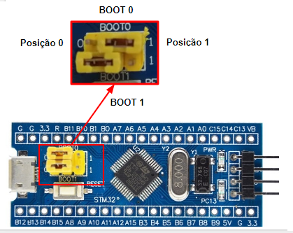
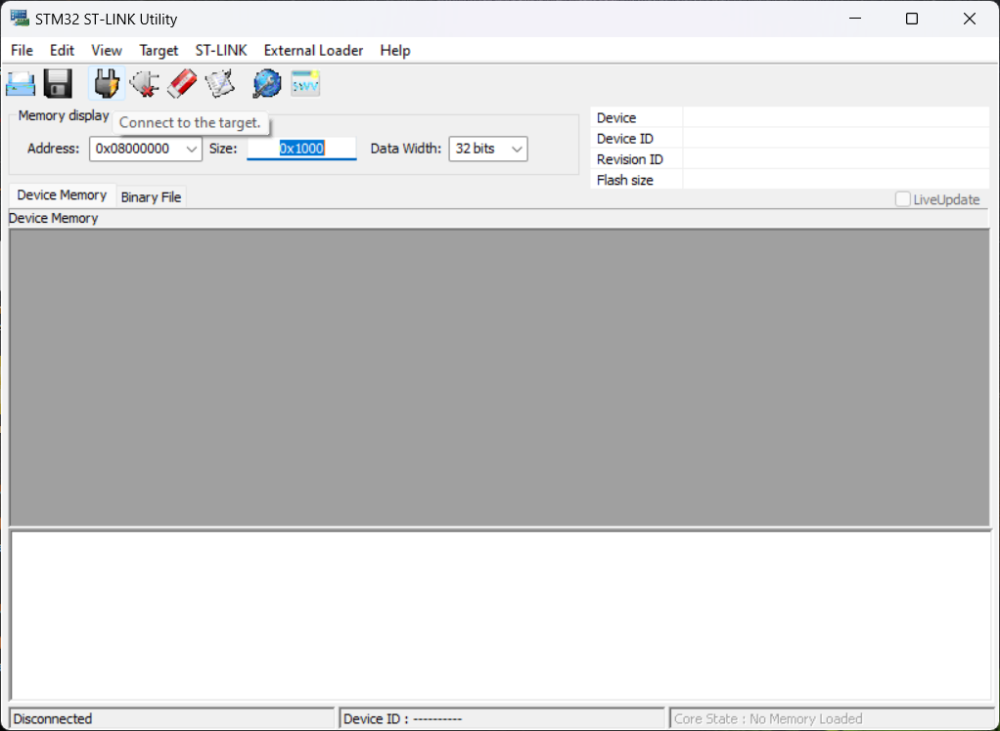
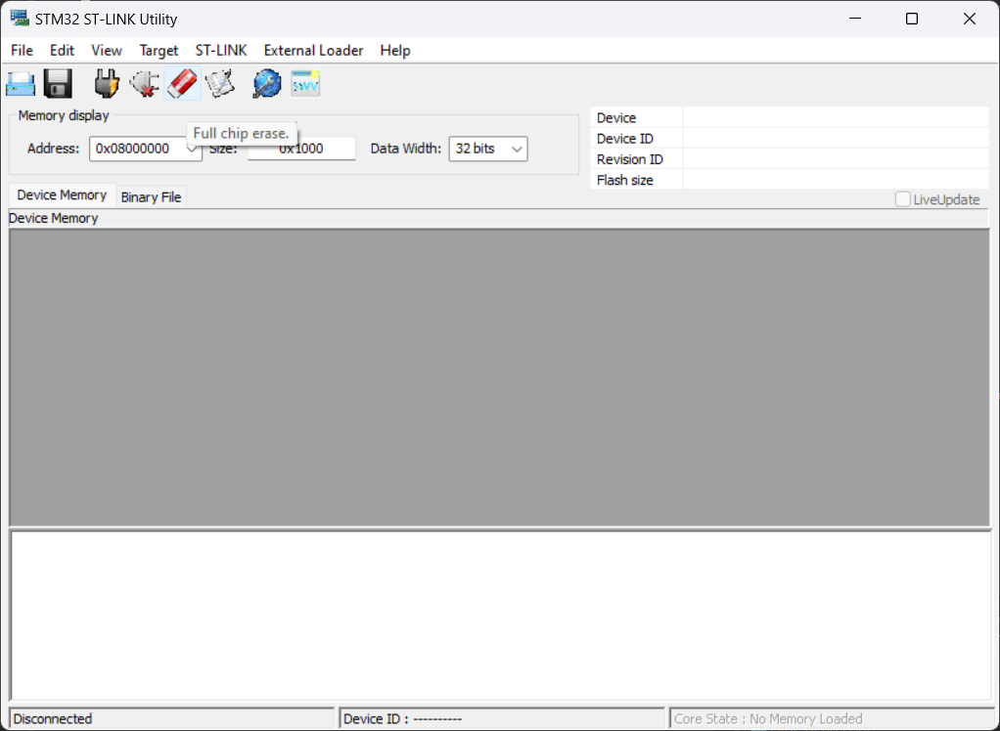
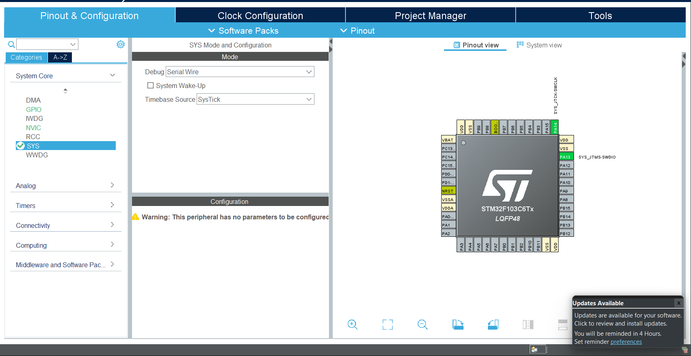

# Total Bandwidth Server and Non-Preemptive Protocol Implementation on MirOS

## Student Information

Name: Italo Miranda Kusmin Alves  
Matriculation: 22101930

## Total Bandwidth Server Implementation

To implement the Total Bandwidth Server (TBS), the first change was to modify the `OSThread` structure by adding two additional parameters: `aperiodicParameters` for aperiodic tasks, which store the computation time of each task, and `periodicParameters`, which store the relative deadline and relative period. The period and deadline are dynamically adjusted to select the task with the earliest deadline.

A new vector of structs, `OS_APThread`, was created to store the started aperiodic tasks. Additionally, `OS_APreadyIndex` was introduced to keep track of the aperiodic tasks that are ready to run.

Next, the `OSAperiodic_thread_start` function was implemented. Its purpose is similar to `OSThread_start`, but with a key difference: aperiodic tasks start with the ready index set to 0 (not ready to run). This function initializes the `aperiodicParameters` structure with the received computation time and sets the deadline to `UINT32_MAX`. In contrast, `OSThread_start` initializes the `periodicParameters` with the user-provided parameters.

The TBS implementation is achieved using the `OS_TBS` function, which applies the TBS algorithm to set task deadlines and update the ready index to 1 (ready to run). The deadline is calculated as follows:

$$
D_i = \max(t_{current}, D_{last}) + \frac{C_i}{U_s}
$$

where  $D_i$ is the deadline, $t_{current}$ is the current time, $D_{last}$ is the last deadline, $C_i$ is the computation time, and $U_s$ is the server utilization. Essentially, the deadline assigned to the task is the sum of the current time (or the last deadline, whichever is greater) and the ratio of the task's computation time to the server utilization. The Earliest Deadline Scheduler then schedules the aperiodic task if its deadline is earlier than those of the periodic tasks. `OS_EarliestPeriodicDeadline` and `OS_EarliestAperiodicDeadline` were created to calculate and return the earliest periodic and aperiodic tasks, respectively. They are called in `OS_tick`, and the aperiodic task's earliest deadline is checked only when the server is active. This means that if the server has at least one task ready to run, it is identified by the function `OS_AperiodicTaskAvailable`.

Finally, the `OS_waitNextOccurence` function was implemented, functioning similarly to `OS_waitNextPeriod`. It handles the end of a task's execution by resetting the deadline to `UINT32_MAX` and the ready index to 0 (not ready to run). When they are called, these functions calculate the next earliest deadline task and then call `OS_sched`.

## Aperiodic Task Implementation

An aperiodic task was implemented with the function `TaskDiagnostics`. It is activated when the PB0 pin receives an interruption, triggering the callback `HAL_GPIO_EXTI_Callback`, which then calls `OS_TBS`. In this process, the task is set to active and is scheduled when it has the earliest deadline, just like a normal task.

## Non-Preemptive Protocol Implementation

The non-preemptive protocol was implemented by adding a parameter `NPPprio` to the `OS_thread` structure. This parameter is set to the maximum value when a thread enters a critical region, preventing other threads from being scheduled. The thread keeps track of the critical regions it enters, ensuring that `NPPprio` is reset only when it exits the last critical region.

## Schedulability Analysis

The schedulability analysis ensures that all tasks meet their deadlines, both periodic and aperiodic. The computation time was measured in the second project. Then, a significant safety margin was incorporated into the execution times to guarantee that tasks complete within their deadlines even under varying load conditions. This is crucial because the computation time of each task is needed by the TBS to calculate the deadlines.

### Task Execution Times, Deadlines, and Periods

| Task Name | Execution Time (ms) | Deadline (ms) | Period (ms) |
|-----------|----------------------|---------------|-------------|
| SENS      | 50                   | 200           | 200         |
| CTRL      | 100                  | 500           | 500         |

### Aperiodic Tasks

| Task Name | Execution Time (ms) | Deadline (ms) |
|-----------|----------------------|---------------|
| DIAG      | 30                   | -             |

### Utilization Calculation

To determine if the tasks are schedulable using the Earliest Deadline First (EDF) algorithm, we need to ensure that the total utilization is less than or equal to 1. The utilization $U$ for each periodic task is calculated as follows:

$$ U_i = \frac{C_i}{T_i} $$

where:
- $C_i$ is the execution time of the task.
- $T_i$ is the period of the task.

#### Task SENS
$$ U_{SENS} = \frac{50 \, \text{ms}}{200 \, \text{ms}} = 0.25 $$

#### Task CTRL
$$ U_{CTRL} = \frac{100 \, \text{ms}}{500 \, \text{ms}} = 0.20 $$

### Total Utilization for Periodic Tasks
$$ U_{total} = U_{SENS} + U_{CTRL} = 0.25 + 0.20 = 0.45 $$

Since the total utilization for periodic tasks is 0.45, which is less than 1, these periodic tasks are schedulable under the EDF algorithm.

### Schedulability of Aperiodic Task (DIAG)

For aperiodic tasks, schedulability depends on the available slack time in the schedule of periodic tasks. The task `DIAG` has an execution time of 30 ms. Since the utilization of the periodic tasks is 0.45, there is remaining utilization available for aperiodic tasks:

$$ U_{remaining} = 1 - U_{total} = 1 - 0.45 = 0.55 $$

To determine if `DIAG` can be scheduled, we need to ensure that it can fit within the available slack time. Given that it does not have a specified period and is event-driven (triggered by an interrupt on PB0), we check if the system can accommodate its execution time within the slack.

- Execution Time of DIAG: 30 ms
- Total available time in a 200 ms period (least common multiple of periods of periodic tasks): $200 \times 0.55 = 110 \ \text{ms}$

Since the execution time of `DIAG` (30 ms) is less than the available slack time (110 ms) in a 200 ms window, `DIAG` is schedulable within the system.

### Conclusion

The given periodic tasks (SENS and CTRL) are schedulable under the EDF algorithm as their total utilization is less than 1. The aperiodic task (DIAG) is also schedulable as its execution time fits within the available slack time of the periodic tasks.

## Problems Solved with the STM32 BluePill

Many of the STM32f1 series (Bluepill) have problems being recognized during the first use with the ST-LINK V2. To solve these problems, it was observed that using the STLink Utility, which can be found at this link: [STLink Utility](https://www.st.com/en/development-tools/stsw-link004.html), it is possible to resolve the issue by following these steps:

1. Change both jumpers of the boot to the "1" position, accessing the RAM memory of the STM32.
   
   ### Boot Example
   

2. Connect to the target using the STLink Utility.
   
   ### Connect to Target
   

3. Perform a full chip erase.
   
   ### Full Chip Erase
   

4. Finally, change the boot jumpers back to the "0" position and try to run your project again.

If you encounter problems debugging your project, it can be resolved in two ways:
- If your project doesn't have an `.ioc` file, you must uninstall and reinstall the STM32CubeIDE.
- If your project has an `.ioc` file, go to "Pinout & Configuration," then "System Core," and change the "Debug" option to "Serial Wire."

  ### System Core
   
