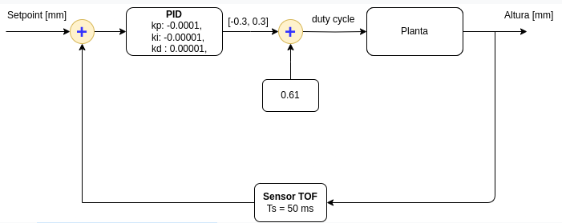
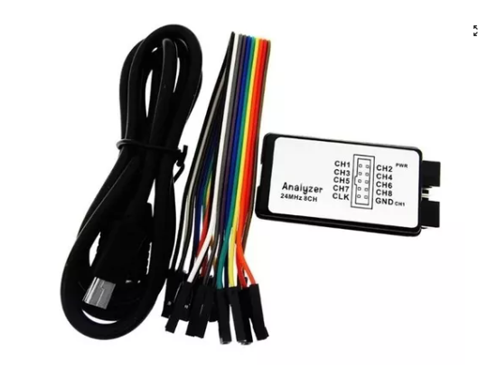
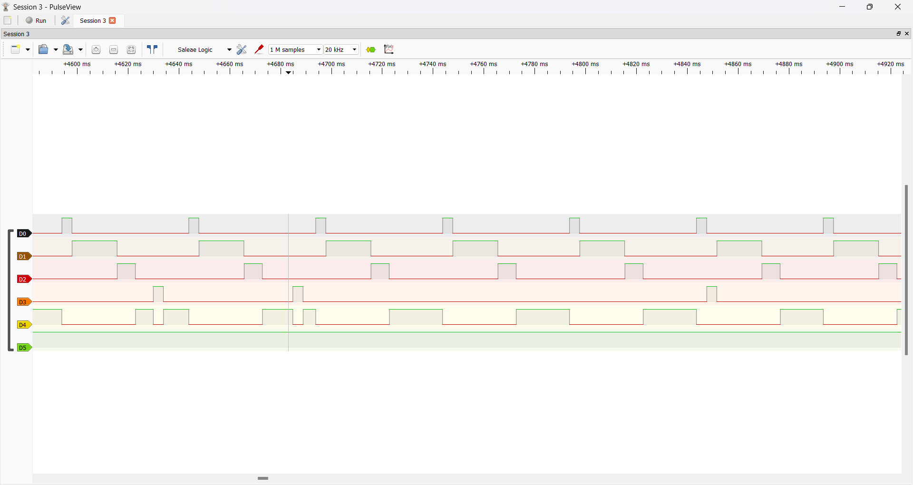

# PID Controller for the Height of a Ping Pong Ball on MiROS

## Students Information

Names: Gustavo Moro, Italo Miranda Kusmin Alves, Pedro Augusto Dantas Vargas.

Matriculations: 22101929, 22101930, 22103666.

## Project Objective

The objective of this project is to implement a PID controller to maintain the height of a ping pong ball using a fan controlled by PWM. The system will utilize a VL53L0X distance sensor to measure the height of the ball and an STM32F103 microcontroller to process the sensor data and control the fan. The project aims to demonstrate the effectiveness of using an EDF scheduler to manage periodic and aperiodic tasks within a real-time operating system.

The specific goals of the project are:

1. To read the distance from the VL53L0X sensor at regular intervals.
2. To calculate the appropriate fan speed using a PID controller based on the measured distance and the desired set point.
3. To control the fan speed using PWM to maintain the ping pong ball at the desired height.
4. To handle aperiodic tasks, such as changing the set point based on external inputs, using the TBS server implemented previously.
5. To ensure that all tasks meet their deadlines using the EDF scheduling algorithm implemented previously.

This project will showcase the implementation of real-time control systems and the use of scheduling algorithms to manage task execution in embedded systems following this plant:

### Plant

## Utilized Components

1. FAN Delta Electronics (Model AUB0912VH-CX09), which is activated using PWM.
2. Distance sensor VL53L0X, which utilizes the I2C protocol to send the distance information.
3. Microcontroller STM32F103.

## Periodic Tasks

As periodic tasks, scheduled by the EDF Scheduler, we have:

1. `TaskREAD`: This task is responsible for reading the VL53L0X sensor. The "VL53L0X-STM32F103" library from "MarcelMG" was used for communication, found in the references section. It uses B6 as SCL and B7 as SDA.
2. `TaskPID`: This task is responsible for calculating the PID controller with given Kp, Ki, and Kd values. The proportional term is calculated by multiplying Kp by the error (difference between the distance read and the set point). The integral term is computed by integrating the error over time, multiplying the time variation between reads by the error, and then by Ki. The derivative term is calculated by finding the difference between the current error and the last error, dividing by the time variation between reads, and multiplying by Kp. The PID value, representing the duty cycle percentage, is the sum of these terms. The time variation used is equal to the task period. While the `HAL_GetTick` function was tried for accurate time variation, constant value performance was better due to the variance affecting PWM stability.
3. `TaskCTRL`: This task sets the PWM value based on the calculated PID plus an adjustment of 61% duty cycle. It uses A0 as the PWM pin.

All three tasks have a period and deadline of 50ms, aligned with the sensor read period. The utilization with this period remains well below 1, ensuring schedulability under the EDF scheduler.

## Aperiodic Tasks

As an aperiodic task, scheduled with the help of the TBS Server, we have:

1. `TaskCH`: This task changes the setpoint from 600 to 200, activated by an interrupt on pin B0.

## Critical Regions

There are four critical regions, protected by four semaphores using the Non-preemptive protocol:
- `measuredValueSemaphore`: Protects sensor readings, shared by `TaskREAD` and `TaskPID`.
- `setPointSemaphore`: Protects the set point, shared by `TaskPID` and `TaskCH`.
- `pidValueSemaphore`: Protects the PID value, shared by `TaskPID` and `TaskCTRL`.
  
### Scheduler Corrections

In an attempt to implement an Event Viewer using a Logic Analyzer and Pulse View, some errors were found in the scheduler logic, specifically in the `OS_waitNextOccurrence` and `OS_waitNextPeriod` functions. These errors were affecting the correct functioning of the scheduler, particularly when aperiodic tasks arrived at the server. These functions were not checking if more aperiodic tasks were available on the server. After applying the corrections, it was possible to validate the scheduler by using three generic periodic tasks and one aperiodic task with the same parameters as the final project tasks. These tasks used `HAL_GetTick` to ensure they ran for the exact time they were initialized for, and utilized the NPP to avoid context switches.

### Logic Analyzer

   

### Tasks Execution Viewer

   

In the figure above, D0 represents the periodic Task A (5ms execution time, 50ms deadline, and 50ms period), D1 represents the periodic Task B, D2 represents the periodic Task C (5ms execution time, 50ms deadline, and 50ms period), D3 represents the aperiodic Task D (10ms execution time), and D4 represents the Idle Thread.

The code used with the logic analyzer can be found here: [Src/TasksViewer.c](./Src/TasksViewer.c)

## Schedulability Analysis

The schedulability analysis ensures that all tasks meet their deadlines, both periodic and aperiodic. The computation times were measured in the second project, with significant safety margins incorporated to guarantee task completion within deadlines even under varying load conditions. This is crucial because the computation time of each task is needed by the TBS to calculate deadlines.

### Task Execution Times, Deadlines, and Periods

| Task Name | Wors Case Execution Time (ms) | Deadline (ms) | Period (ms) |
|-----------|----------------------|---------------|-------------|
| READ      | 10                   | 50            | 50          |
| PID       | 25                   | 50            | 50          |
| CTRL      | 5                    | 50            | 50          |

### Aperiodic Tasks

| Task Name | Worst Case Execution Time (ms) | Deadline (ms) |
|-----------|----------------------|---------------|
| CH        | 10                   | -             |

### Utilization Calculation

To determine if the tasks are schedulable using the Earliest Deadline First (EDF) algorithm, we need to ensure that the total utilization is less than or equal to 1. The utilization $U$ for each periodic task is calculated as follows:

$$ U_i = \frac{C_i}{T_i} $$

where:
- $C_i$ is the execution time of the task.
- $T_i$ is the period of the task.

#### Task READ
$$ U_{READ} = \frac{10 \, \text{ms}}{50 \, \text{ms}} = 0.2 $$

#### Task PID
$$ U_{PID} = \frac{25 \, \text{ms}}{50 \, \text{ms}} = 0.5 $$

#### Task CTRL
$$ U_{CTRL} = \frac{5 \, \text{ms}}{50 \, \text{ms}} = 0.1 $$

### Total Utilization for Periodic Tasks
$$ U_{total} = U_{READ} + U_{PID} + U_{CTRL} = 0.2 + 0.5 + 0.1 = 0.8 $$

Since the total utilization for periodic tasks is 0.8, which is less than 1, these periodic tasks are schedulable under the EDF algorithm.

### Schedulability of Aperiodic Task

For aperiodic tasks, schedulability depends on the available slack time in the schedule of periodic tasks. The task `CH` has an execution time of 10 ms. Since the utilization of the periodic tasks is 0.8, there is remaining utilization available for aperiodic tasks:

$$ U_{remaining} = 1 - U_{total} = 1 - 0.8 = 0.2 $$

To determine if `CH` can be scheduled, we need to ensure that it can fit within the available slack time. Given that it does not have a specified period and is event-driven (triggered by an interrupt on B0), we check if the system can accommodate its execution time within the slack.

- Execution Time of CH: 10 ms
- Total available time in a 50 ms period: $50 \times 0.2 = 10 \, \text{ms}$

Since the execution time of `CH` (10 ms) is equal to the available slack time (10 ms) in a 50 ms window, `CH` is schedulable within the system.

### Conclusion

The given periodic tasks (READ, PID, and CTRL) are schedulable under the EDF algorithm as their total utilization is less than 1. The aperiodic task (CH) is also schedulable as its execution time fits within the available slack time of the periodic tasks.

## References

Giorgio C. Buttazzo. 2011. Hard Real-Time Computing Systems: Predictable Scheduling Algorithms and Applications (3rd. ed.). Springer Publishing Company, Incorporated.
G M. M. VL53L0X C library for STM32F103. Available on: https://github.com/MarcelMG/VL53L0X-STM32F103
